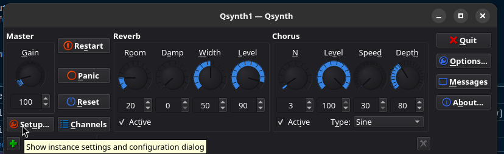
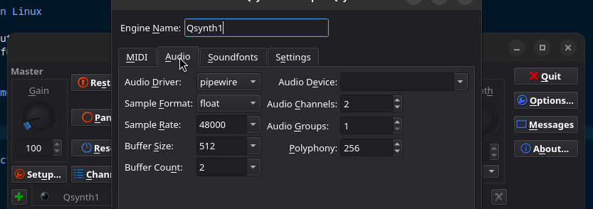

# Music for Claw

<https://docs.google.com/document/d/18cRRIteJDQn-CBmRg6dTErAG0EIQwiTElpupEn6HLs4/edit?tab=t.0>

If you want music you need to use a synthesizer like QSynth. Extract the CLAW.SF2 File from the Iso and put it into the folder:

1. Install the flatpak version:

```sh
flatpak install qsynth
```

2.Run flatpak

```sh
flatpak run org.rncbc.qsynth
```

3.Add the Music



4.Edit the settings so that it aligns to the screenshot


5.Add the Soundfile


6. Start the game - you should hear music in the levels

## How to get the Soundfile

The soundfile can be extracted from the claw cd image

the file is called `CLAW.SF2`
